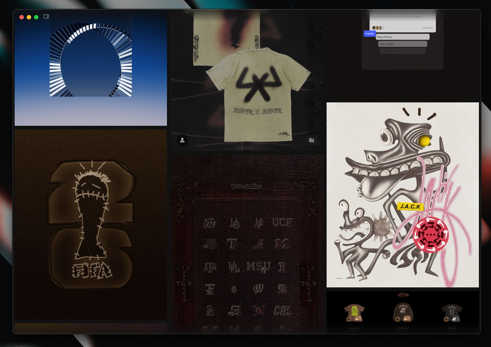

# Koi

Your visual references, close to home.

Koi is a fast, local-first moodboard for images, GIFs, videos, saved pages, and articles. Everything stays in folders on your computer—no account or cloud sync required.



## What you can do

- Turn local folders into moodboards
- Search by name, folder, tag, color, or source
- Browse large libraries without slowing down
- Save useful pages and media with their original source
- Copy, preview, organize, and delete files with keyboard shortcuts

## Get Koi

Download the latest version from [Koi releases](https://github.com/max-pantom/koi/releases).

- **macOS:** choose the `.dmg` for Apple Silicon (`arm64`) or Intel (`x64`)
- **Windows:** choose the `.msi` or `.exe`
- **Linux:** choose the `.AppImage` or `.deb`

Open Koi, select **Add folder**, and choose a folder of references. If macOS blocks an unsigned build, allow Koi from **System Settings → Privacy & Security** only when you downloaded it from this repository.

## Save from Chrome

[Koi Capture](chrome-extension/README.md) is the optional Chrome extension. It saves images, GIFs, videos, pages, and articles straight into Koi while keeping their source details.

Download the extension ZIP from [Koi releases](https://github.com/max-pantom/koi/releases), unzip it, then load the folder from `chrome://extensions` with **Developer mode** enabled.

## Build it locally

You’ll need Node.js 22+, stable Rust, and the [Tauri 2 prerequisites](https://v2.tauri.app/start/prerequisites/).

```bash
npm ci
npm test
npm run tauri dev
```

Create a production build with `npm run tauri -- build`.

## Join in

Ideas, bug reports, and pull requests are welcome. Read [Contributing](CONTRIBUTING.md) to get started, and please follow our [Code of Conduct](CODE_OF_CONDUCT.md).

Koi is available under the [MIT License](LICENSE).
